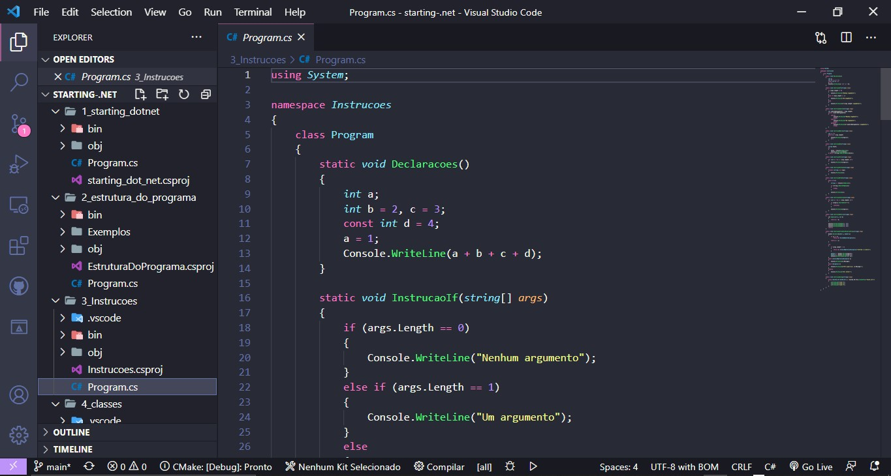

 

    
    
    

<h3 align="center">Primeiros passos com .NET + C#</h3>

 

### exemplo

<h4 align="justify">
    exemplo
    </h4>
   
 

    
        

 

&emsp;&emsp;&emsp;&emsp;&emsp;&emsp;&emsp;&emsp;&emsp;&emsp;&emsp;&emsp;&emsp;&emsp;&emsp;&emsp;&emsp;&emsp;&emsp;&emsp;⬆️[Back to top](#back-to-top)⬆️ 

